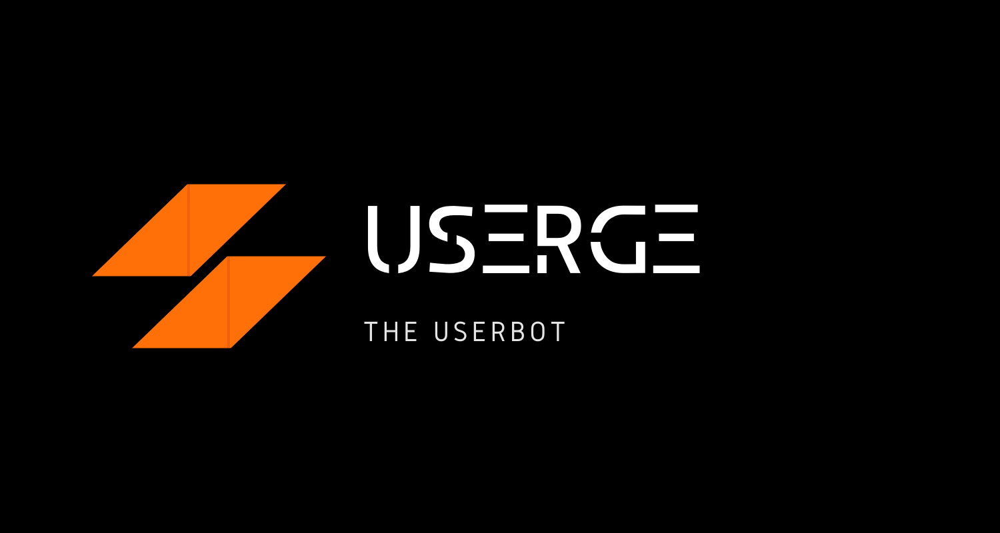

<p align="center">
    <a href="https://github.com/uaudith/Userge">
        
    </a>
    <br>
    <b>Pluggable Telegram UserBot</b>
    <br>
    <a href="https://github.com/uaudith/Userge#inspiration">Inspiration</a>
    &nbsp•&nbsp
    <a href="https://github.com/uaudith/Userge#features">Features</a>
    &nbsp•&nbsp
    <a href="https://github.com/uaudith/Userge#example-plugin">Example</a>
    &nbsp•&nbsp
    <a href="https://github.com/uaudith/Userge#requirements">Requirements</a>
    &nbsp•&nbsp
    <a href="https://github.com/uaudith/Userge#project-credits">Project Credits</a>
    &nbsp•&nbsp
    <a href="https://github.com/uaudith/Userge#copyright--license">Copyright & License</a>
</p>

# Userge

> **Userge** is a Powerful , _Pluggable_ Telegram UserBot written in _Python_ using [Pyrogram](https://github.com/pyrogram/pyrogram).

## Inspiration

> This project is inspired by the following projects :)

* [tg_userbot](https://github.com/watzon/tg_userbot) (heavily)
* [PyroGramUserBot](https://github.com/SpEcHiDe/PyroGramUserBot)
* [Telegram-Paperplane](https://github.com/RaphielGang/Telegram-Paperplane)
* [UniBorg](https://github.com/SpEcHiDe/UniBorg)

> Special Thanks to all of you !!!.

## Features

* Powerful and Very Usefull build in plugins
* Channel log support
* Database support
* Easy to setup
* Easy to use
* Easy to add plugins
* Improved user friendliness of plugins

## Example Plugin

```python
from userge import userge, Message

LOG = userge.getLogger(__name__)  # logger object
CHANNEL = userge.getCLogger(__name__)  # channel logger object

@userge.on_cmd("test", about="help text to this command")  # adding handler and help text to .test command
async def testing(message: Message):
   LOG.info("starting test command...")  # log to console
   await message.edit("testing...", del_in=5)  # this will be automatically deleted after 5 sec
   CHANNEL.log("testing completed!")  # log to channel
```

## Requirements

* Python 3.8 or Higher
* Telegram [API Keys](https://my.telegram.org/apps)
* MongoDB [Database URL](https://cloud.mongodb.com/)
* Google Drive [API Keys](https://console.developers.google.com/)

## How To Deploy

> If you are using [HEROKU](https://www.heroku.com/) simply click the button below.

[](https://heroku.com/deploy?template=https://github.com/uaudith/Userge)

> TODO: add Docker Support.

### Project Credits

* [Specially these projects](https://github.com/uaudith/Userge#inspiration)
* [@uaudIth](https://t.me/uaudIth)
* [@K_E_N_W_A_Y](https://t.me/K_E_N_W_A_Y)
* [@nawwasl](https://t.me/nawwasl)
* [@gotstc](https://t.me/gotstc)

### Copyright & License

* Copyright (C) 2020 [@SLBOTS](https://t.me/slbotsupdates)
* Licensed under the terms of the [GNU GENERAL PUBLIC LICENSE Version 3, 29 June 2007](https://github.com/uaudith/Userge/LICENSE)