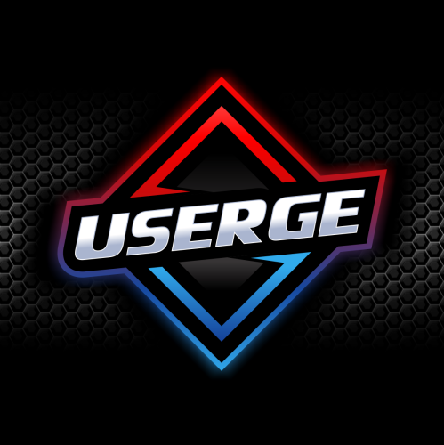

    
     
    <b>Pluggable Telegram UserBot</b>
     
    <a href="https://github.com/UsergeTeam/Userge#inspiration-">Inspiration</a>
    &nbsp•&nbsp
    <a href="https://github.com/UsergeTeam/Userge#documentation-">Documentation</a>
    &nbsp•&nbsp
    <a href="https://github.com/UsergeTeam/Userge#deployment-">Deployment</a>
    &nbsp•&nbsp
    <a href="https://github.com/UsergeTeam/Userge#project-credits-">Project Credits</a>
    &nbsp•&nbsp
    <a href="https://github.com/UsergeTeam/Userge#copyright--license-">Copyright & License</a>

# NavaAssist

> **NavaAssist** is a customized version of **[Userge](https://github.com/UsergeTeam/Userge)** created by [Navaneeth R](https://github.com/NavaneethRenjith8282).

## Userge 🔥

> **Userge** is a Powerful , _Pluggable_ Telegram UserBot written in _Python_ using [Pyrogram](https://github.com/pyrogram/pyrogram).

## About this project

**NavaAssist** is the customized version of **[Userge](https://github.com/UsergeTeam/Userge)** userbot used by [Navaneeth R](https://github.com/NavaneethRenjith8282).

He is using this repo for his `UPSTREAM_REPO` var to make edits and to create his own Userge. You can see that it is forked.

## Inspiration 😇

> Userge is inspired by the these projects :)

[Specially to these projects of **Userge**](https://github.com/UsergeTeam/Userge#inspiration-) 🥰

> Special Thanks to all of you !!!.

## [Documentation](http://theuserge.tech) 📘

## [Deployment](http://theuserge.tech/deployment) 👷

For deployment, visit **[UsergeTeam/Userge](https://github.com/UsergeTeam/Userge)**.

## [Plugins](https://github.com/UsergeTeam/Userge-Plugins) 🔌

### Support & Discussions 👥

> Head over to the [Discussion Group](https://t.me/usergeot) and [Update Channel](https://t.me/theUserge)

### Project Credits 💆‍♂️

* **Error:** Project credits data cleared by **[Shrimadhav U K](https://github.com/spechide)**!
* [Contributors](https://github.com/UsergeTeam/Userge/graphs/contributors) 👥

### Copyright & License 👮

* Forked by [Navaneeth R](https://github.com/NavaneethRenjith8282) from [UsergeTeam/Userge](https://github.com/UsergeTeam/Userge)
* Copyright (C) 2020 - 2021 by [UsergeTeam](https://github.com/UsergeTeam) ❤️️
* Licensed under the terms of the [GNU GENERAL PUBLIC LICENSE Version 3, 29 June 2007](https://github.com/UsergeTeam/Userge/blob/master/LICENSE)
